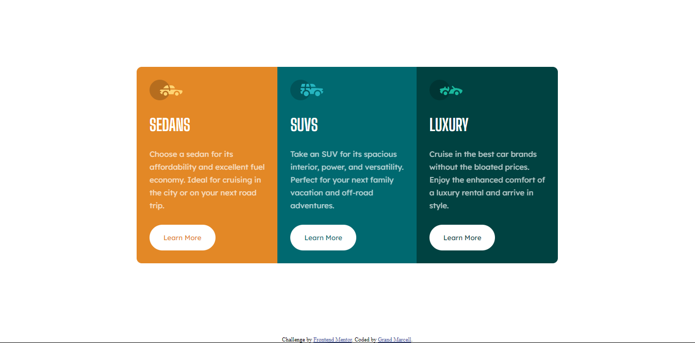

# Frontend Mentor - 3-column preview card component solution

This is a solution to the [3-column preview card component challenge on Frontend Mentor](https://www.frontendmentor.io/challenges/3column-preview-card-component-pH92eAR2-). Frontend Mentor challenges help you improve your coding skills by building realistic projects. 

## Table of contents

- [Overview](#overview)
  - [The challenge](#the-challenge)
  - [Screenshot](#screenshot)
  - [Links](#links)
- [My process](#my-process)
  - [Built with](#built-with)
  - [What I learned](#what-i-learned)
  - [Continued development](#continued-development)
  - [Useful resources](#useful-resources)
- [Author](#author)
- [Acknowledgments](#acknowledgments)

**Note: Delete this note and update the table of contents based on what sections you keep.**

## Overview

### The challenge

Users should be able to:

- View the optimal layout depending on their device's screen size
- See hover states for interactive elements

### Screenshot

### Links

- Solution URL: [Add solution URL here](https://your-solution-url.com)
- Live Site URL: [Add live site URL here](https://your-live-site-url.com)

## My process

First I Build the HTML File, and import the font that needed. ANd then I start with styling the mobile view first, after the mobile view done just add the media Query for the laptop view

### Built with

- Semantic HTML5 markup
- CSS custom properties
- Flex Display
- Mobile-first workflow

### What I learned

I learn how to use the flex display, and more fluent in styling my HTML.

### Continued development

**Note: Delete this note and the content within this section and replace with your own plans for continued development.**

### Useful resources

- [FreeCodeCamp](https://www.freecodecamp.org/news/how-to-center-anything-with-css-align-a-div-text-and-more/) - This helped me for center the container div

## Author

- LinkedIn - [LinkedIn](https://www.linkedin.com/in/grandmarcell)
- Frontend Mentor - [@GMarcell](https://www.frontendmentor.io/profile/GMarcell)
